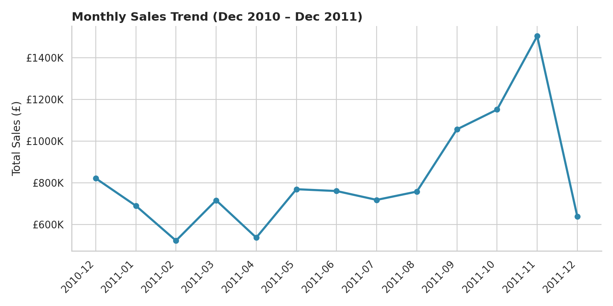
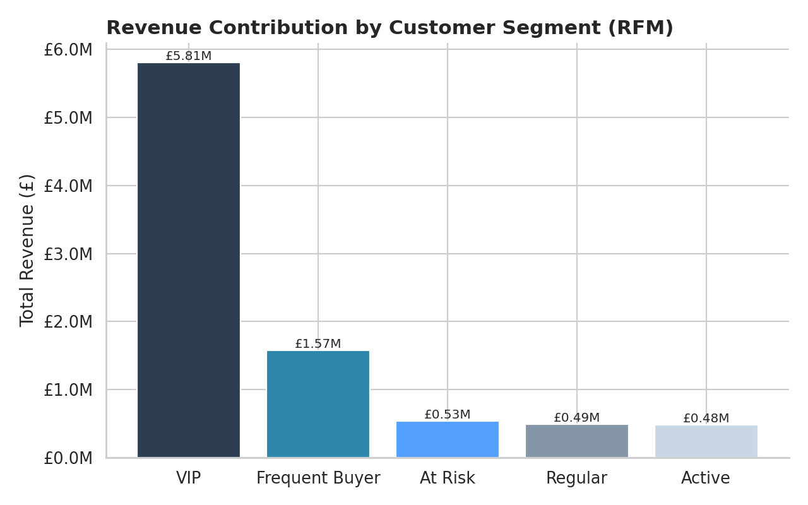
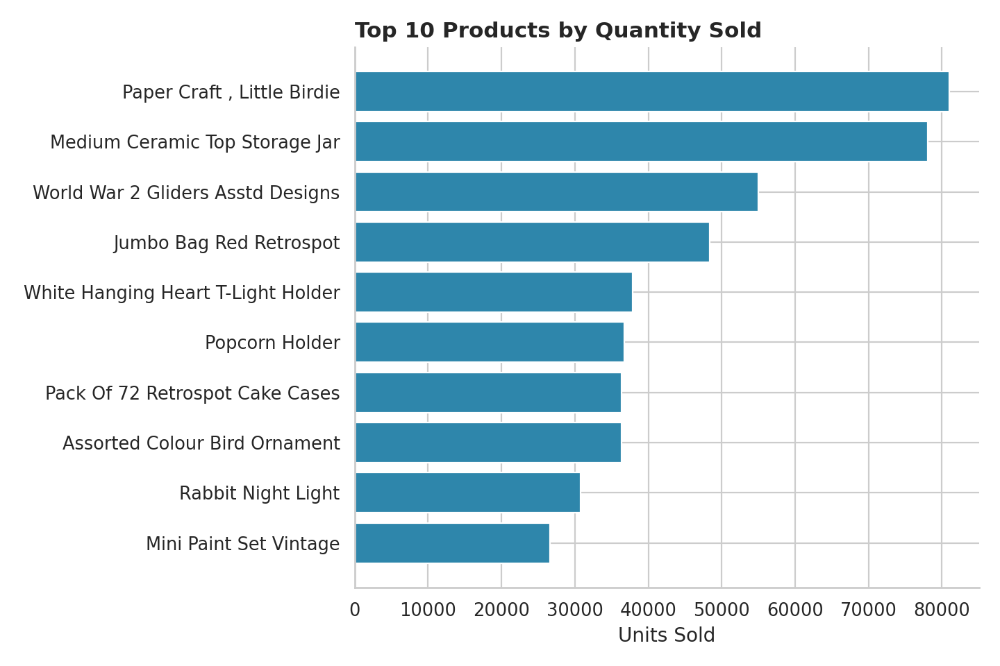
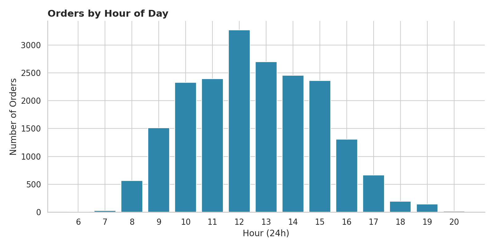
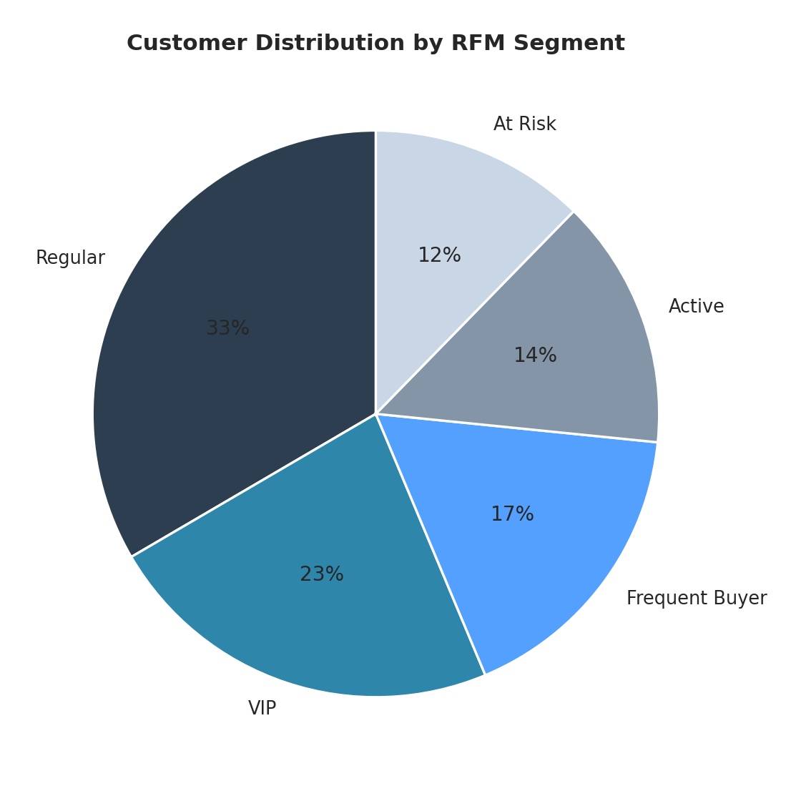

# 🛍️ Online Retail Customer & Sales Analysis (SQL)

End-to-end data analysis project on the **Online Retail II** transaction
dataset (541,910 UK e-commerce transactions, Dec 2010 – Dec 2011). All data
cleaning, feature engineering, and business analysis is done in **SQL**
against a SQLite database. Python is used only for I/O (loading the source
file, exporting results, and generating preview charts) — no data cleaning
or business logic lives in Python.

The cleaned, feature-engineered output is exported to CSV and connected to
an interactive **Power BI** dashboard.

## Why SQL for this one

Most of my other portfolio projects use Python/pandas end-to-end. This one
is deliberately built as a SQL-first project — cleaning, feature
engineering, RFM segmentation, and business aggregations are all written
as auditable `.sql` scripts, which is closer to how this kind of analysis
is actually done in a data warehouse / BI setting.

## Project structure

```
├── data/
│   ├── raw/                  # original source data (untouched)
│   └── processed/            # final CSVs, ready for Power BI import
├── sql/
│   ├── 01_data_cleaning.sql        # nulls, cancellations, invalid rows, duplicates
│   ├── 02_feature_engineering.sql  # revenue, calendar parts, time buckets
│   ├── 03_rfm_analysis.sql         # Recency/Frequency/Monetary + segmentation
│   └── 04_business_insights.sql    # all reporting views
├── scripts/
│   ├── 01_load_raw_data.py         # loads raw file into SQLite (no cleaning)
│   ├── 02_export_for_powerbi.py    # exports final tables to CSV
│   └── 03_generate_charts.py       # quick-look PNG charts from the SQL views
├── reports/figures/          # chart previews (see below)
└── retail.db                 # SQLite database (all tables/views)
```

## How to reproduce

```bash
pip install -r requirements.txt

# 1. Load the raw file into SQLite
python scripts/01_load_raw_data.py --source data/raw/online_retail_II_RAW.xlsb

# 2. Run the SQL pipeline, in order
sqlite3 retail.db < sql/01_data_cleaning.sql
sqlite3 retail.db < sql/02_feature_engineering.sql
sqlite3 retail.db < sql/03_rfm_analysis.sql
sqlite3 retail.db < sql/04_business_insights.sql

# 3. Export the results for Power BI + generate preview charts
python scripts/02_export_for_powerbi.py
python scripts/03_generate_charts.py
```

## Data cleaning summary

| Step | Rows removed | Reason |
|---|---|---|
| Cancelled orders (`Invoice` starts with `C`) | 9,288 | Returns/cancellations, not sales |
| Non-positive quantity or price | ~7,743 additional | Fees, adjustments, data errors |
| **Result** | **524,879 clean transaction rows** | out of 541,910 raw rows |

Rows with a missing `Customer ID` (135,080) are **kept** for country/product
level analysis but excluded from customer-level analysis (RFM), since a
customer cannot be identified. Full reasoning is documented inline in
`sql/01_data_cleaning.sql`.

## RFM segmentation

Customers are scored 1–5 on Recency, Frequency and Monetary value
(quintiles), then bucketed into five segments. Full scoring logic is in
`sql/03_rfm_analysis.sql`.

| Segment | Customers | Revenue |
|---|---|---|
| VIP | 993 | £5.81M |
| Frequent Buyer | 741 | £1.57M |
| At Risk | 534 | £0.53M |
| Regular | 1,450 | £0.49M |
| Active | 620 | £0.48M |

**Key insight:** the top 23% of customers (VIP segment) drive ~66% of total
revenue — a clear signal to prioritize retention offers for this group and
build a win-back campaign for the "At Risk" segment before they churn
entirely.

## Preview charts







## Tools used

- **SQL (SQLite)** — data cleaning, feature engineering, RFM analysis, business queries
- **Python** (pandas, pyxlsb) — file I/O only
- **Matplotlib / Seaborn** — preview charts
- **Power BI** — interactive dashboard

## Data source

[Online Retail II Dataset](https://archive.ics.uci.edu/dataset/502/online+retail+ii) — UCI Machine Learning Repository.
