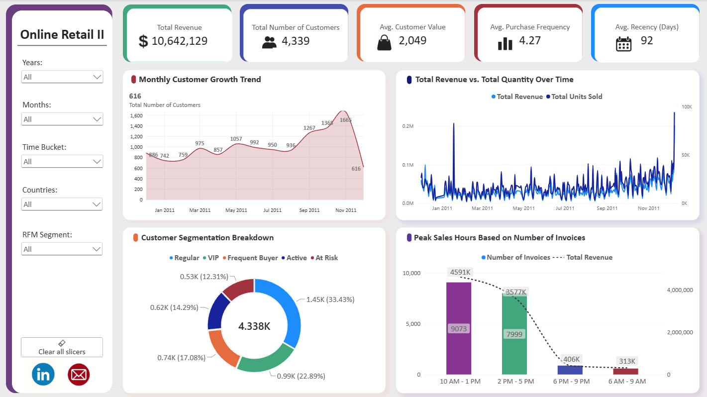
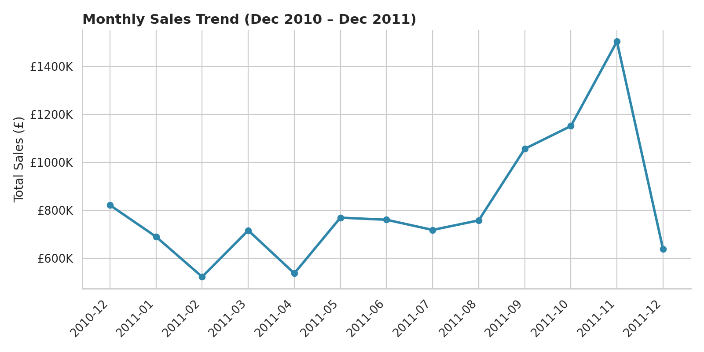
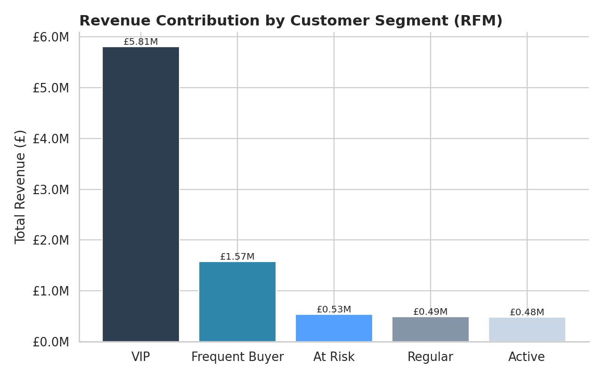
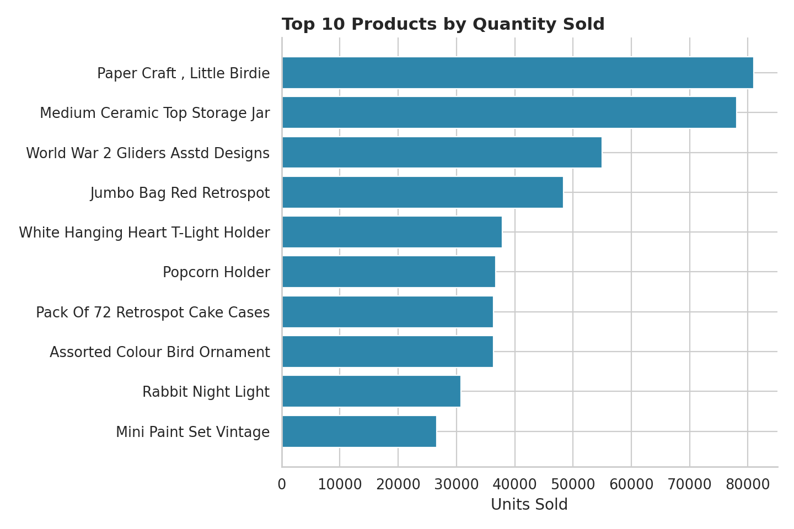
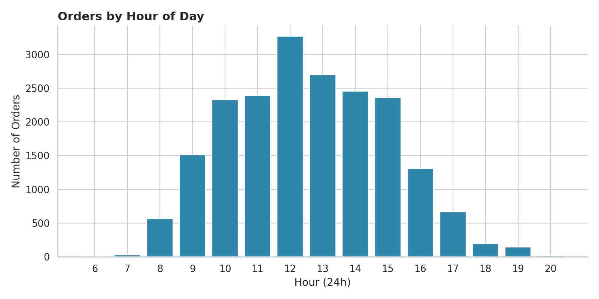
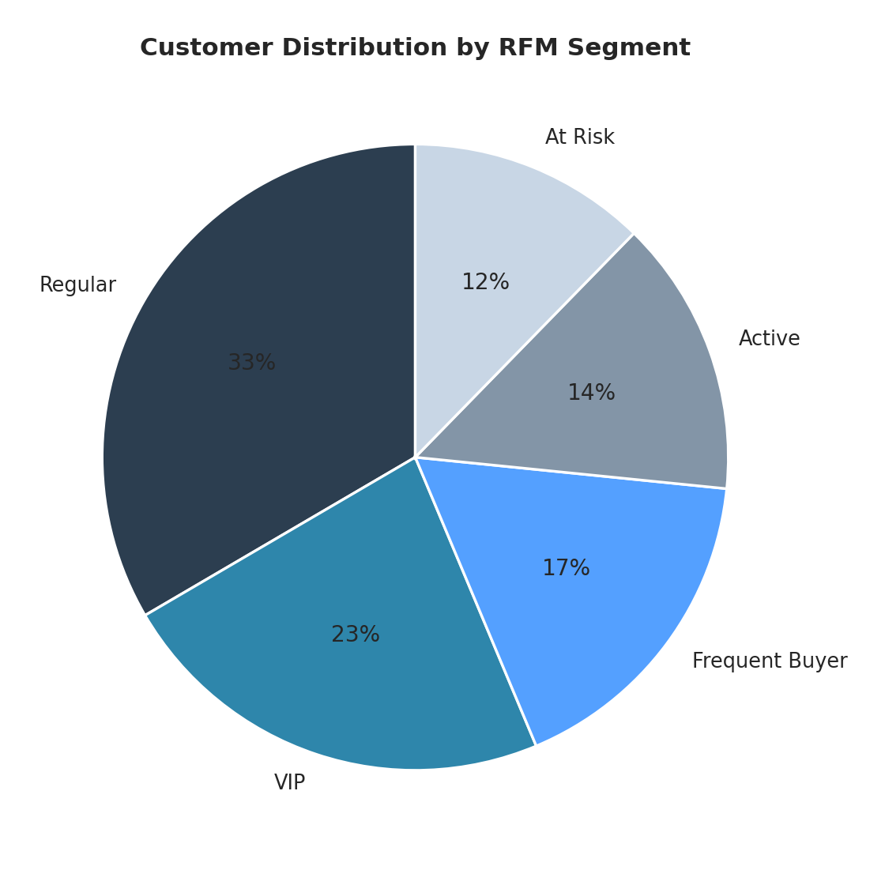

# Online Retail Customer & Sales Analysis (SQL)

I analyzed the Online Retail II dataset, which has 541,910 UK e-commerce transactions from Dec 2010 to Dec 2011. All the cleaning, feature engineering and business analysis is written in SQL and runs on a SQLite database. Python only handles input and output: loading the source file, exporting results and drawing preview charts. No cleaning or business logic lives in Python.

The final cleaned output is exported to CSV and connected to an interactive Power BI dashboard.

## Highlight findings

- The VIP segment is the top 23% of customers (993 people) and brings in about 66% of total revenue. That makes retention offers for this group the clearest priority.
- The "At Risk" segment has 534 customers and £0.53M in revenue. It's worth a win-back campaign before those customers churn completely.
- Only 15–37% of each month's new customers come back in the following month, depending on the cohort.
- After cleaning, 524,879 of the 541,910 raw rows remain. Every cleaning step is logged, so nothing was dropped silently.

## Power BI Dashboard



The dashboard is built on `fact_transactions.csv` and `dim_customer_rfm.csv`, related on `customer_id`. It includes:

- KPI cards: Total Revenue, Total Number of Customers, Avg. Customer Value, Avg. Purchase Frequency, Avg. Recency (Days)
- Monthly Customer Growth Trend, showing new customers per month
- Total Revenue vs. Total Quantity Over Time, a combo chart of the monthly trend
- Customer Segmentation Breakdown, a donut chart by RFM segment
- Peak Sales Hours Based on Number of Invoices, using time-of-day buckets
- Slicers for Year, Month, Time Bucket, Country and RFM Segment

The `.pbix` file is in `powerbi/Dashboard.pbix`.

## Preview charts

<table>
  <tr>
    <td width="33%"></td>
    <td width="33%"></td>
    <td width="33%"></td>
  </tr>
  <tr>
    <td align="center">Monthly Sales Trend</td>
    <td align="center">Revenue by Segment</td>
    <td align="center">Top 10 Products</td>
  </tr>
  <tr>
    <td width="33%"></td>
    <td width="33%"></td>
    <td width="33%"></td>
  </tr>
  <tr>
    <td align="center">Peak Hours</td>
    <td align="center">Customer Distribution</td>
    <td></td>
  </tr>
</table>

## RFM segmentation

I scored customers from 1 to 5 on Recency, Frequency and Monetary value (quintiles), then grouped them into five segments. The full scoring logic is in `sql/03_rfm_analysis.sql`.

| Segment | Customers | Revenue |
|---|---|---|
| VIP | 993 | £5.81M |
| Frequent Buyer | 741 | £1.57M |
| At Risk | 534 | £0.53M |
| Regular | 1,450 | £0.49M |
| Active | 620 | £0.48M |

## Data cleaning summary

| Step | Rows affected | Action |
|---|---|---|
| Cancelled orders (`Invoice` starts with `C`) | 9,288 | Moved to `cancelled_transactions` |
| Non-positive quantity or price | 3,853 | Removed |
| Exact duplicate rows | 4,842 | Removed |
| Country name standardization (EIRE, RSA, USA, Unspecified) | 8,991 | Standardized |
| Administrative/non-product stock codes (POST, DOT, M, C2, D, S, BANK CHARGES, AMAZONFEE, CRUK, B) | 2,308 | Flagged (`is_adjustment_code`), kept |
| Statistical outliers (IQR method, quantity/price) | 27,111 / 37,828 | Flagged (`is_outlier_quantity` / `is_outlier_price`), kept. A large wholesale order is real data, not an error |
| Missing Customer ID | 132,186 | Flagged, kept for country and product analysis, excluded from RFM |
| **Result** | **524,879 clean transaction rows** | out of 541,910 raw rows |

Every step is written to a `data_quality_log` audit table (see `sql/01_data_cleaning.sql`) with the exact rule, the rows affected and what I did about them.

## Advanced analysis

Beyond the original dashboard, `sql/05_advanced_analysis.sql` uses window functions and self-joins for:

- Month-over-month growth: the sales trend with `LAG()` to get the % change
- Cohort retention: the % of each month's new customers still active in the following months, using a self-join on each customer's first purchase month
- Customer Lifetime Value (CLV): total revenue, active tenure, and a 12-month projection at each customer's current purchase pace
- Market basket analysis: which products are most often bought together in the same invoice, using a self-join on `invoice_no`

## Why SQL

I wrote the cleaning, feature engineering, RFM segmentation and business aggregations as plain `.sql` scripts, so every step can be read and audited. That's also closer to how this kind of work is done in a data warehouse or BI setting.

## Project structure

```
├── data/
│   ├── raw/                  # original source data (untouched)
│   └── processed/            # final CSVs, ready for Power BI import
├── sql/
│   ├── 01_data_cleaning.sql        # nulls, cancellations, invalid rows, duplicates
│   ├── 02_feature_engineering.sql  # revenue, calendar parts, time buckets
│   ├── 03_rfm_analysis.sql         # Recency/Frequency/Monetary + segmentation
│   ├── 04_business_insights.sql    # all reporting views
│   └── 05_advanced_analysis.sql    # cohort retention, CLV, market basket, MoM growth
├── scripts/
│   ├── 01_load_raw_data.py         # loads raw file into SQLite (no cleaning)
│   ├── 02_export_for_powerbi.py    # exports final tables to CSV
│   └── 03_generate_charts.py       # quick-look PNG charts from the SQL views
├── reports/figures/          # chart previews
└── retail.db                 # SQLite database (all tables/views)
```

## How to reproduce

```bash
pip install -r requirements.txt

# 1. Load the raw file into SQLite
python scripts/01_load_raw_data.py --source data/raw/online_retail_II_RAW.xlsb

# 2. Run the SQL pipeline, in order
sqlite3 retail.db < sql/01_data_cleaning.sql
sqlite3 retail.db < sql/02_feature_engineering.sql
sqlite3 retail.db < sql/03_rfm_analysis.sql
sqlite3 retail.db < sql/04_business_insights.sql
sqlite3 retail.db < sql/05_advanced_analysis.sql

# 3. Export the results for Power BI and generate preview charts
python scripts/02_export_for_powerbi.py
python scripts/03_generate_charts.py
```

## Tools used

- SQL (SQLite) for data cleaning, feature engineering, RFM analysis and business queries
- Python (pandas, pyxlsb) for file I/O only
- Matplotlib / Seaborn for preview charts
- Power BI for the interactive dashboard

## Data source

[Online Retail II Dataset](https://archive.ics.uci.edu/dataset/502/online+retail+ii), UCI Machine Learning Repository.

## Author

Hi, I'm Parnaz Ali, the author of this project. If you have questions or want to talk about it, send me an email.

[](mailto:parnazali1383@gmail.com)
